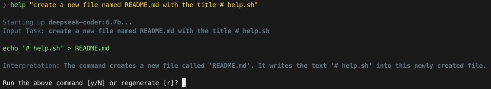

# help.sh



A simple shell script that runs a given shell task stated in natural language, by generating an appropriate command using a _locally-run_ LLM (Ollama).

## Prerequisites

- [bash](https://www.gnu.org/software/bash/)
- [ollama](https://ollama.com) with any version of `deepseek-coder` (configurable)
- [jq](https://jqlang.github.io/jq/)

## Usage

```
$ ./help.sh [instructions...]
```

For example:

```
$ ./help.sh "list files in current directory"

ls

Run the above command [y/N] or regenerate [r]?
```

Quotes are optional (all arguments are concatenated).

Configure the `MODEL` environment variable to temporarily change the model used.
A partial match is sufficient - the first match in `ollama ls` is used. For example:

```
$ MODEL=your-model help "list files in current directory"
```

Use `DEFAULT_HELP_SH_MODEL` to set a default model to search for. The default is 'deepseek-coder'.
For example, in your `.bashrc`:

```sh
export DEFAULT_HELP_SH_MODEL=your-model
```

To see these instructions at any time, run the script without any arguments:

```
$ ./help.sh
```


## Setup

You may symlink or alias `help` to this script for easier access. For example, in your `.bashrc`, add:

```bash
alias help='path/to/help.sh'
```

where `path/to/help.sh` is the path to the script. Then, you can run the script with the following instead:

```bash
$ help [instructions...]
```

## Privacy

`help.sh` provides basic knowledge of your system name and the current working directory to the LLM.

As it uses local LLMs downloaded via `ollama`, it works without a network connection, and your requests never leave your device.

